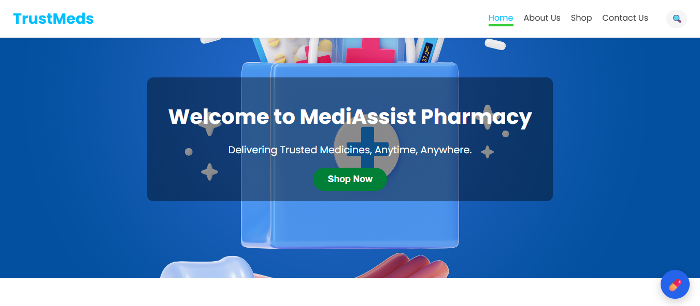
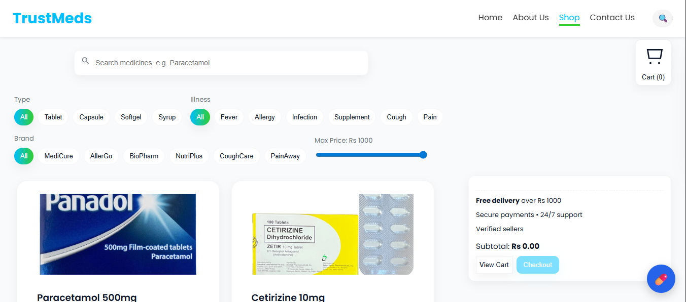

# 🏥 Pharmacy Web Application

This is a pharmacy web application built with **React, CSS, and TypeScript**.  
It provides users with essential pages like **Home, About Us, Shop, and Contact Us** along with advanced features like a **Virtual Assistant (chatbot)** and **Online Medicine Ordering**.

---

## 🚀 Live Preview  
🔗 [View Live Demo](https://devKashifrehman.github.io/Pharmacy-app/)  


---

## 📸 Screenshots  

### 🏠 Home Page  


### 🛒 Shop Page  


---

## ✨ Features  
- 🏠 **Home, About Us, Shop, Contact Us Pages**  
- 🤖 **Virtual Assistant (Pharmacy Chatbot)** – helps with basic queries in English & Roman Urdu  
- 💊 **Online Medicine Ordering Facility**  
- 📱 **Responsive Design** – works on desktop and mobile  
- ⚡ Built with **React + TypeScript + CSS** for performance and maintainability  

---

## 🛠️ Tech Stack  
- **Frontend:** React, TypeScript, CSS  
- **Chatbot:** Custom-built Virtual Assistant  
- **Deployment:** *(Github)*

---

## 📦 Installation  

1. Clone the repository  
   ```
   git clone https://github.com/devKashifRehman/pharmacy-app.git
   cd pharmacy-app
````

2. Install dependencies

   npm install
   

3. Start development server

   npm start
   

4. Build for production

   npm run build

---

## 👨‍💻 Author

Developed by **Kashif Rehman**

🔗 [GitHub](https://github.com/devKashifrehman)
🔗 [LinkedIn](https://www.linkedin.com/in/kashif-rehman-04620a26b/)

---

------

## © Copyright & Usage

© 2026 Kashif Rehman. All Rights Reserved.

This project, including its design, structure, and source code, is the intellectual property of **Kashif Rehman**.

Permission is hereby granted to view, fork, and use this project **for personal, educational, and portfolio purposes only**, provided that proper credit is given to the author.

❌ Commercial use, redistribution, resale, or claiming this project as your own work is strictly prohibited without prior written permission from the author.